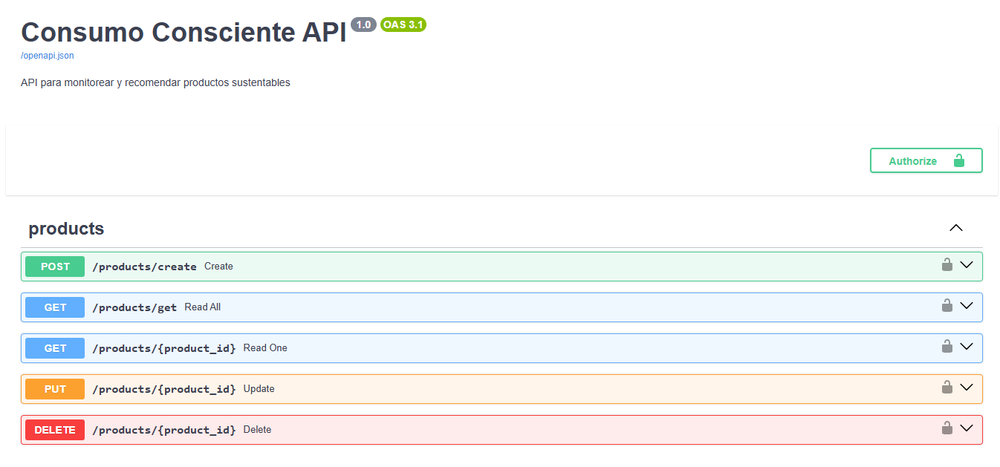
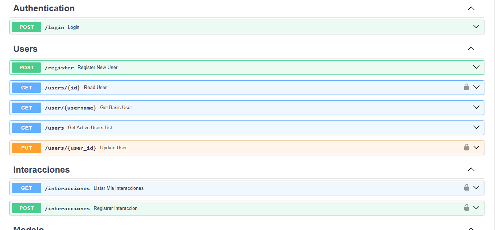
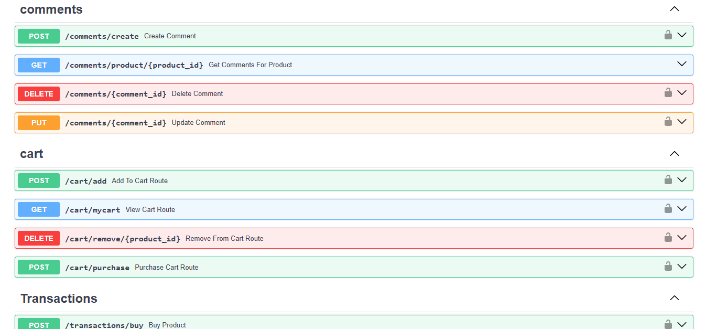

# 📌 API – Consumo Consciente  

## 📂 Código Fuente
El código fuente del backend se encuentra en el repositorio:  
**Repositorio API:** [URL_del_repositorio](https://github.com/Alex01Dev/backend-cc.git)  

- Lenguaje y framework: **Python + FastAPI**  
- Base de datos: **MySQL**  
- Modelos de ML: **Scikit-learn** (supervisado y no supervisado)  

---

## 🔄 Operaciones CRUD Básicas  

Las operaciones CRUD se diseñaron para manejar las entidades principales del sistema:  

- **Usuarios**  
- **Productos**  
- **Compras**  
- **Carrito de Compras**  
- **Interacciones**  
- **Comentarios** (solo se agregan, no hay update/delete)  

---

## 📑 Listado de EndPoints  

### 👤 Usuarios  
| Método | Endpoint | Descripción |
|--------|----------|-------------|
| **GET** | `/api/users` | Obtener listado de usuarios. |
| **POST** | `/api/users` | Crear un nuevo usuario. |
| **GET** | `/api/users/{id}` | Obtener información de un usuario por ID. |
| **PUT/PATCH** | `/api/users/{id}` | Actualizar datos de un usuario existente. |
| **DELETE** | `/api/users/{id}` | Eliminar usuario. |

---

### 📦 Productos  
| Método | Endpoint | Descripción |
|--------|----------|-------------|
| **GET** | `/api/products` | Listar todos los productos. |
| **POST** | `/api/products` | Crear un producto nuevo. |
| **GET** | `/api/products/{id}` | Obtener detalle de un producto. |
| **PUT/PATCH** | `/api/products/{id}` | Actualizar producto. |
| **DELETE** | `/api/products/{id}` | Eliminar producto. |

---

### 🛒 Carrito de Compras  
| Método | Endpoint | Descripción |
|--------|----------|-------------|
| **GET** | `/api/cart/{user_id}` | Obtener el carrito de un usuario. |
| **POST** | `/api/cart/{user_id}/add` | Agregar un producto al carrito. |
| **PUT/PATCH** | `/api/cart/{user_id}/update/{product_id}` | Actualizar cantidad de un producto en el carrito. |
| **DELETE** | `/api/cart/{user_id}/remove/{product_id}` | Eliminar un producto del carrito. |
| **DELETE** | `/api/cart/{user_id}/clear` | Vaciar el carrito completo. |

---

### 💳 Compras  
| Método | Endpoint | Descripción |
|--------|----------|-------------|
| **GET** | `/api/purchases` | Listar todas las compras. |
| **POST** | `/api/purchases` | Registrar una compra realizada por un usuario. |
| **GET** | `/api/purchases/{id}` | Obtener detalle de una compra. |
| **GET** | `/api/purchases/user/{user_id}` | Listar compras de un usuario. |
| **DELETE** | `/api/purchases/{id}` | Eliminar compra (opcional). |

---

### 💬 Comentarios  
| Método | Endpoint | Descripción |
|--------|----------|-------------|
| **POST** | `/api/comments` | Crear un nuevo comentario sobre un producto. |
| **GET** | `/api/comments/product/{product_id}` | Listar comentarios de un producto. |

⚠️ Los comentarios solo se **crean y consultan**, no se actualizan ni eliminan.  

---

### 🔄 Interacciones  
| Método | Endpoint | Descripción |
|--------|----------|-------------|
| **GET** | `/api/interactions` | Listar todas las interacciones. |
| **POST** | `/api/interactions` | Registrar una interacción usuario-producto. |
| **GET** | `/api/interactions/user/{user_id}` | Listar interacciones de un usuario. |
| **DELETE** | `/api/interactions/{id}` | Eliminar interacción. |

---

## 📸 Screenshots  

### 🔹 Vista 1 – Usuarios  
  

### 🔹 Vista 2 – Productos  
  

### 🔹 Vista 3 – Dashboard ML  
  

# 🤖 Endpoints con ML  

Los modelos de Machine Learning permiten **analizar datos de consumo** para recomendaciones personalizadas y generar métricas de consumo consciente.  

### 📌 Modelos utilizados:  
- **ML No Supervisado (Recomendaciones):** Genera recomendaciones de productos basadas en clustering según las interacciones y compras de los usuarios.  
- **ML Supervisado (Dashboard):** Analiza datos históricos y muestra métricas de comportamiento de usuarios y productos en un dashboard.  

---

## 📑 Listado de EndPoints ML  

### 🔹 ML No Supervisado  
| Método | Endpoint | Descripción |
|--------|----------|-------------|
| **GET** | `/modelo/entrenar` | Entrena el modelo de recomendaciones no supervisado y devuelve sugerencias personalizadas para el usuario autenticado. |

> ⚠️ Este endpoint está protegido con **JWT** y requiere un usuario autenticado.  

---

### 🔹 ML Supervisado  
| Método | Endpoint | Descripción |
|--------|----------|-------------|
| **GET** | `/ml/dashboard` | Obtiene los datos procesados por el modelo supervisado para alimentar el dashboard de consumo consciente. |

---