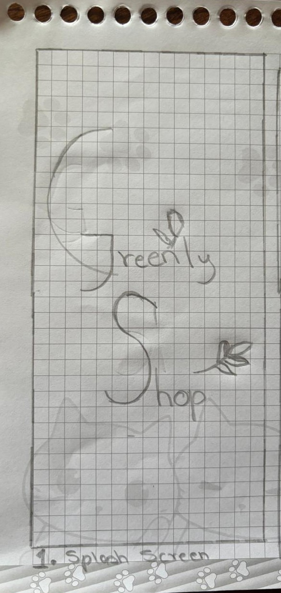
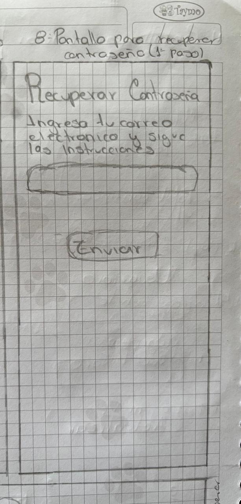
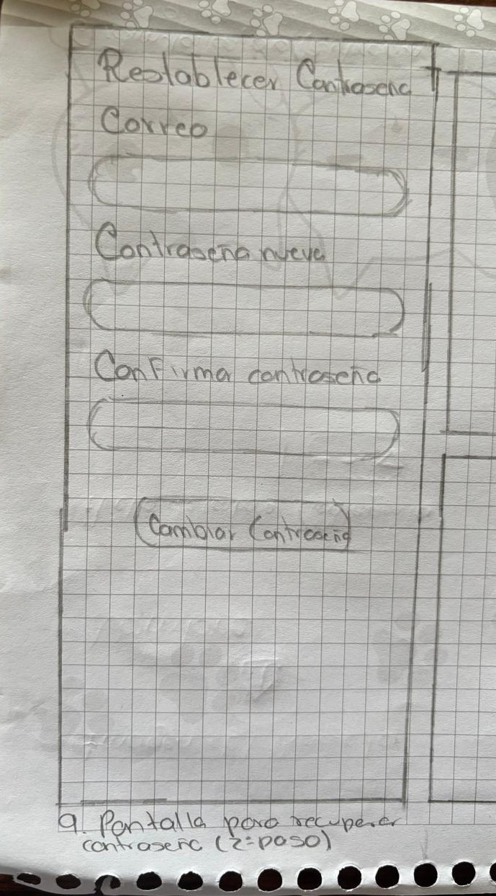
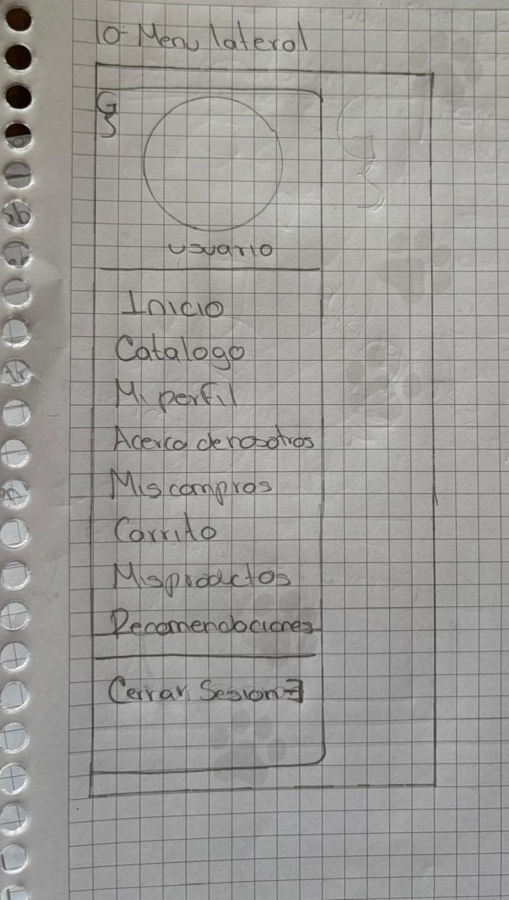
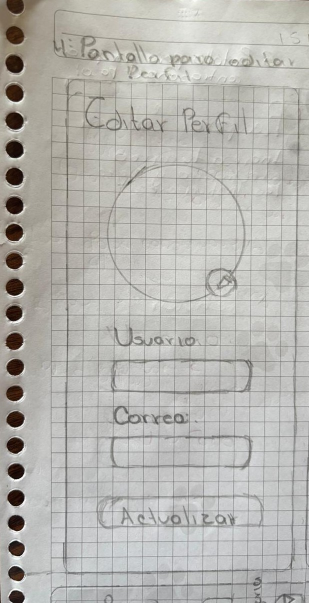
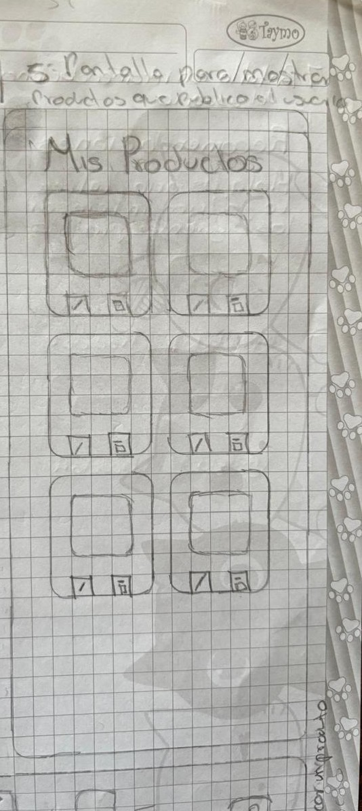
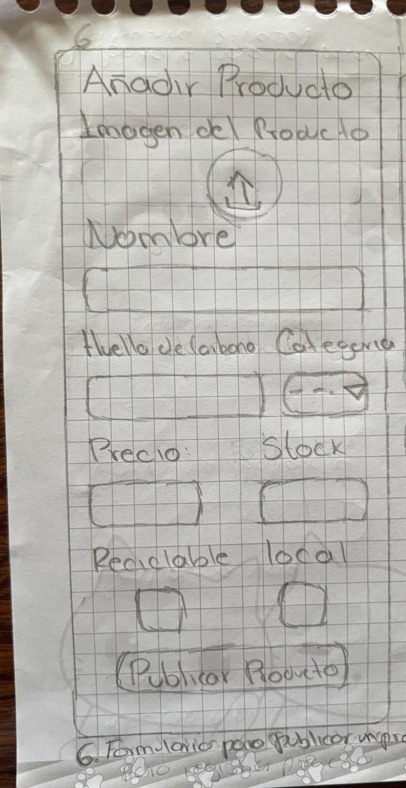
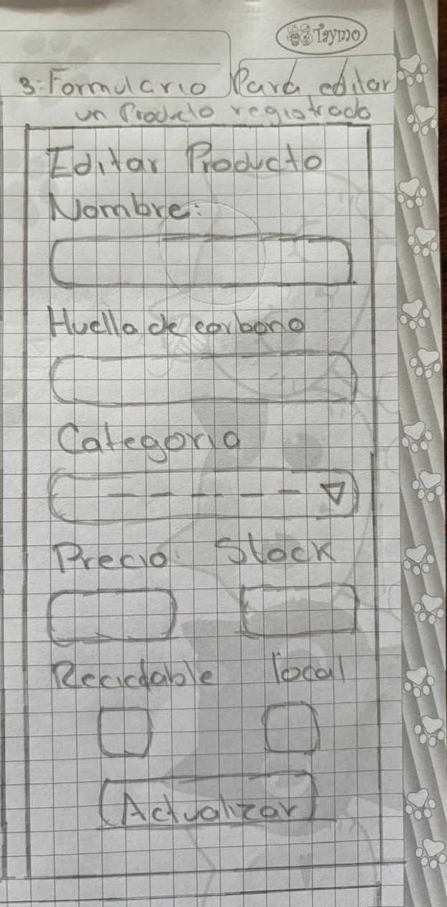
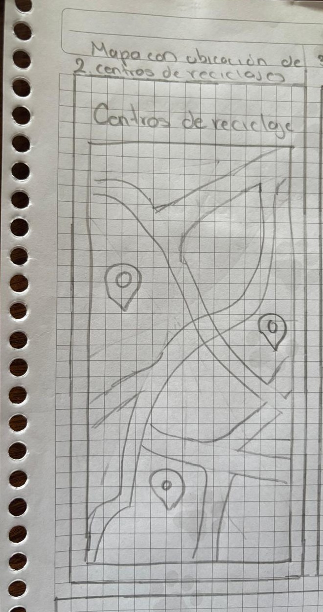
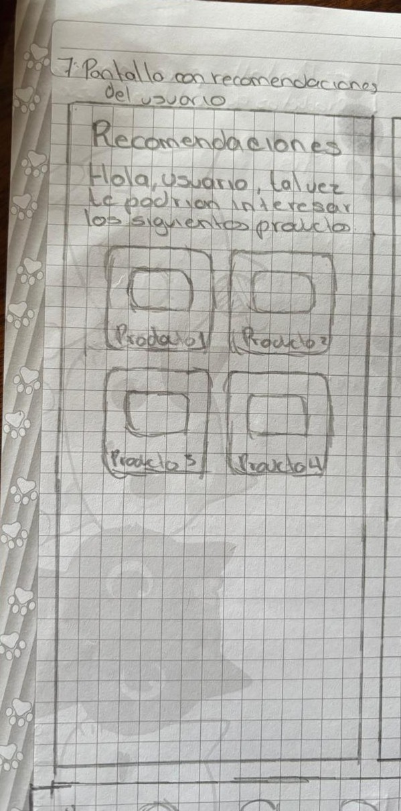

# 🎨 Sketches – Consumo Consciente

Este directorio contiene los **bocetos visuales (sketches)** de la aplicación **Consumo Consciente**, creados como parte del diseño de interfaz y experiencia de usuario (UI/UX).  
Cada imagen representa una pantalla o componente clave del flujo de la app.

---

## Pantallas principales

### Splash Screen
Pantalla inicial que muestra el logo y carga antes del login.

---

### Pantalla de recuperación de contraseña
Ejemplo de flujo de autenticación de usuario.

---

### Menú Lateral
Muestra las diferentes secciones accesibles del usuario (perfil, productos, recomendaciones, mapa, etc.).

---

### Perfil de Usuario
Pantalla de perfil con datos personales, avatar e información de registro.

---

### Mis Productos
Visualización de los productos sostenibles del usuario.

---

### Formulario: Agregar Producto
Formulario para registrar nuevos productos sostenibles.

---

### Formulario: Editar Producto
Pantalla para modificar productos previamente agregados.

---

### Mapa
Mapa con geolocalización de productos y puntos sostenibles cercanos.

---

### Recomendaciones
Pantallas que muestran recomendaciones personalizadas basadas en consumo y sostenibilidad.

---

## 📱 Capturas de sketch juntos
Versiones preliminares o capturas de prototipo compartidas.

---
